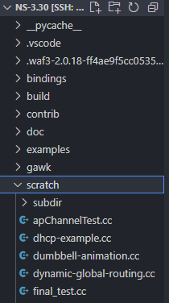

# 关于文件的解释

## 在 NS3 中的文件放置位置

将 gawk 和 scratch 文件夹放在 ns-3.xx 文件夹下，注意的一点是，一些特殊的功能，
如 Sta 能自动切换信道的操作（参见.docx 文件的遇到问题的（1）的第三段）只有在 dev 版本才支持。

## 如何运行仿真及得到.tr 文件 及 xml 文件

在 scratch 目录下，有许多仿真场景，其中`final_test.cc`是.docx 中所描述的场景（即无线网络交付），输入`sudo ./waf --run final_test`即可运行，会生成多个文件，其中：

- 用来计算吞吐量的是`final_test_ftp_server-6-0.tr`即 ftp 服务器的 tracefile。
- 动画演示文件为`final_test.xml`,可直接用 NetAnim 打开。

## 如何运行 gawk 程序计算得到适合放进 Gnuplot 的数据集

在 gawk 目录下运行 `gawk -f thCalculate.awk final_test_ftp_server-6-0.tr > myThroughput`会生成一个 myThroughput 文件，里面就是处理好的数据。

注：请确保 ubuntu 系统中已安装 gawk，似乎不是自带的。

## 运行 gnu.sh 得到输出吞吐量的图片

`./gnu.sh`

注：请不要忘记给 gnu.sh 执行的权限。
